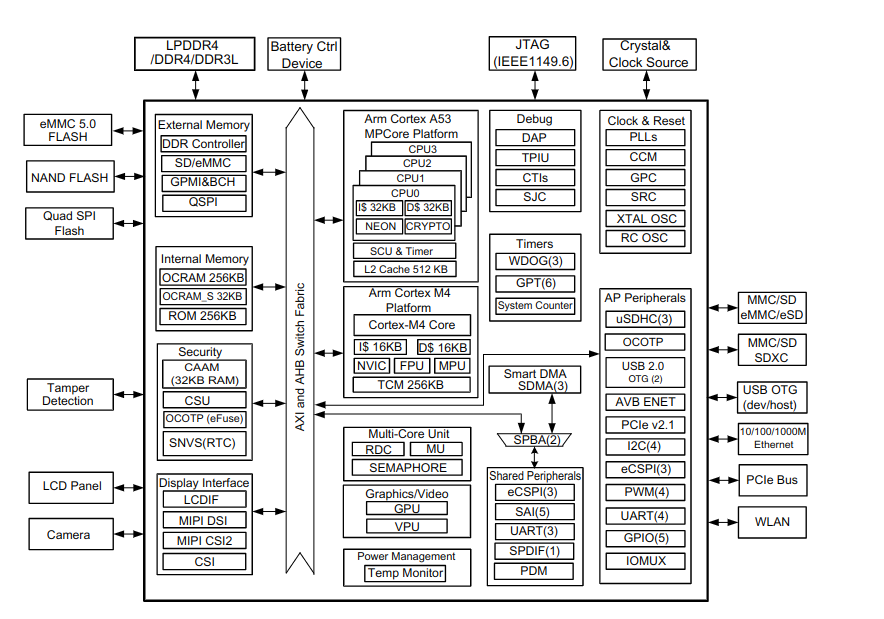

IMX8M SOC
=========

SOC Overview (NXP Reference Manual)

CPU 
---

Cortex A53, Cortex M4 
Little Endian mode only.

Memory Map  
----------

**A53**

**DDR Memory (Quad-A53 only)** - 5120MB  - 0x1_0000_0000 to 0x2_3FFF_FFFF 
**DDR Memory (All modules)**   - 3072MB  - 0x4000_0000 to 0xFFFF_FFFF 

**OCRAM**  - 128KB    -     0x0092_0000 to 0x0093_FFFF 
**OCRAM**  - 128KB    -     0x0090_0000 to 0x0091_FFFF 

**TCMU**   - 128KB    -     0x0080_0000 to 0x0081_FFFF
**TCML**   - 128KB    -     0x007E_0000 to 0x007F_FFFF 

**USB2** - 64K  - 0xB32E5_0000 to 0x32E5_FFFF
**USB1** - 64KB - 0x32E4_0000 to 0x32E4_FFFF

Boot Options 
------------

NAND FLASH (including SLC and MLC)
SDIO / MMC / SDXC
eSD 3.0/eMMC 5.1 (fast boot)
SPI (serial FLASH)
USB
QSPI
Ethernet (via plug-in mode)

Boot Flow 
---------

Boot Container 
--------------

Need to boot the SOC. The files for it are: 

* **Arm Trusted Firmware (ATF)**: 
    * bl31 
* **SPL and U-boot**: 
    * u-boot-spl.bin: u-boot SPL binary
    * u-boot-nodtb.bin: u-boot binary without device tree
    * <board-device-tree>.dtb: u-boot device tree for the board 
* **DDR Training Fimrware** 
    * lpddr4_pmu_train_1d_imem.bin 
    * lpddr4_pmu_train_1d_dmem.bin 
    * lpddr4_pmu_train_2d_imem.bin
    * lpddr4_pmu_train_2d_dmem.bin

To create the boot container use nxp the **imx-mkimage** tool (https://github.com/nxp-imx/imx-mkimage.git).

Example: 

.. code-block:: console 

    make SOC=IMX8MM flash-evk

For Toradex Modules

.. code-block:: console 

    
    make SOC=IMX8MM dtbs=imx8mm-verdin-wifi-dev.dtb flash_evk_emmc_fastboot

Flashing Tool - UUU 
-------------------

U-Boot USB Support 
------------------

* USB device controller for IMX8M is the **ci_udc**.

* For USB Gadget function in SPL we need to enable USB Host too for **usb_lowlevel_init**. This function
is implemented in the usb controller driver and not on the usb device controller driver.

* For USB Controller driver in SPL the ehci controller need the DM (Driver Model) support with config **CONFIG_SPL_DM_USB** set. 