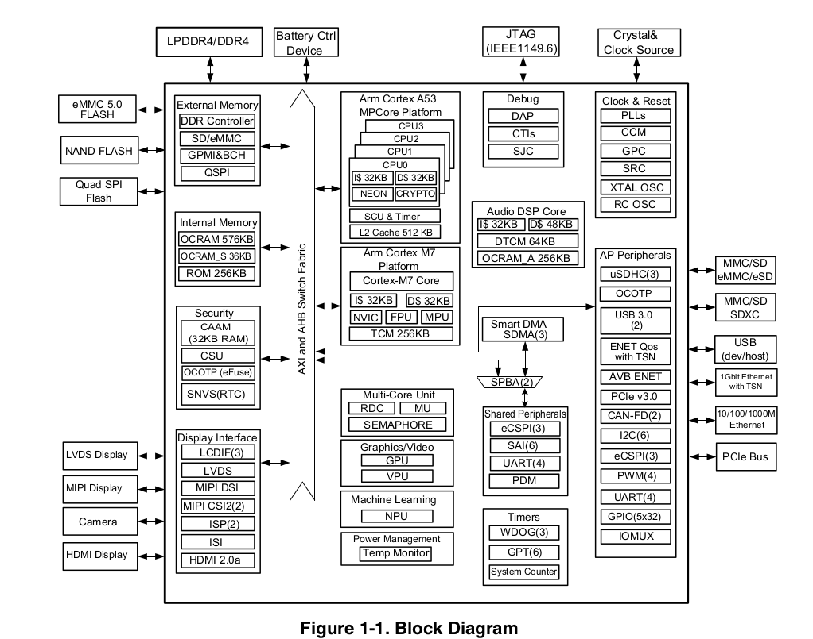

IMX8MM SOC 
===========

SOC Overview (NXP Reference Manual)

CPU 
---

Cortex A53, Cortex M7
Little Endian mode only.

Boot Container 
--------------

Need to boot the SOC. The files for it are: 

* **Arm Trusted Firmware (ATF)**: 
    * bl31 
* **SPL and U-boot**: 
    * u-boot-spl.bin: u-boot SPL binary
    * u-boot-nodtb.bin: u-boot binary without device tree
    * <board-device-tree>.dtb: u-boot device tree for the board 
* **DDR Training Fimrware** 
    * lpddr4_pmu_train_1d_imem.bin 
    * lpddr4_pmu_train_1d_dmem.bin 
    * lpddr4_pmu_train_2d_imem.bin
    * lpddr4_pmu_train_2d_dmem.bin

To create the boot container use nxp the **imx-mkimage** tool (https://github.com/nxp-imx/imx-mkimage.git).

Example: 

.. code-block:: console 

    make SOC=IMX8MM flash-evk

For Toradex Modules

.. code-block:: console 

    
    make SOC=IMX8MM dtbs=imx8mm-verdin-wifi-dev.dtb flash_evk_emmc_fastboot

Flashing Tool - UUU 
-------------------

U-Boot USB Support 
------------------

* For USB boot to work is needed to set **CONFIG_ENV_IS_NOWHERE**
https://www.mail-archive.com/u-boot@lists.denx.de/msg430587.html
https://lore.kernel.org/u-boot/CAOMZO5DXuHBrNR0zmt-+vyPr8Y9ejX07S5nwT1ySZnZBU3nRAA@mail.gmail.com/
https://lore.kernel.org/u-boot/20230828213803.454303-1-marcel@ziswiler.com/
Maybe this solve the issue https://lore.kernel.org/u-boot/20220421172411.1319053-2-festevam@gmail.com/