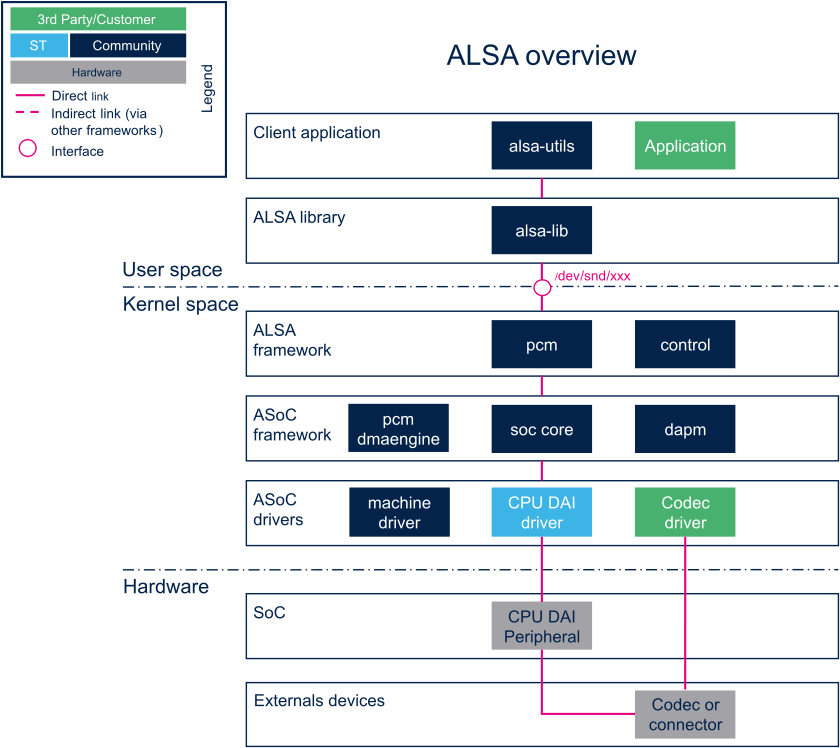

Audio in Linux Systems 
======================

How the Linux Kernel handle audio devices for playback, recording, over the air etc.

https://www.alsa-project.org/wiki/Main_Page
https://github.com/alsa-project
https://wiki.archlinux.org/title/Advanced_Linux_Sound_Architecture
https://wiki.st.com/stm32mpu/wiki/ALSA_overview#:~:text=The%20ALSA%20framework%20provides%20comprehensive,with%20routing%20and%20mixing%20capabilities
https://github.com/diwic/alsa-rs
https://soundprogramming.net/programming/alsa-tutorial-1-initialization/#google_vignette
https://github.com/arcnmx/wireplumber.rs
https://pipewire.org/
https://www.linuxjournal.com/article/6735
https://alsa.opensrc.org/
https://dl.acm.org/doi/fullHtml/10.5555/1080072.1080075
https://tldp.org/HOWTO/Alsa-sound-6.html

Notes 
~~~~~
* For programing use alsalib, rust bindings
* For sound server PipeWire : wirepluber, libpipewire, 
* Read Linux **/proc/asound** interface
* For drivers ASoC read STM32MP1 SAI Interface Driver

ALSA - Archtechture
~~~~~~~~~~~~~~~~~~~
STM32MP1 Wiki ALSA ALSA Overview 
https://wiki.st.com/stm32mpu/wiki/ALSA_overview#:~:text=The%20ALSA%20framework%20provides%20comprehensive,with%20routing%20and%20mixing%20capabilities.

ALSA - ASoC Kernel Framework
~~~~~~~~~~~~~~~~~~~~~~~~~~~~

* Kernel Debug Interface **/sys/kernel/debug/asoc/**

ALSA - Userspace Tools 
~~~~~~~~~~~~~~~~~~~~~~

ALSA - Userspace Configuration 
~~~~~~~~~~~~~~~~~~~~~~~~~~~~~~

ALSA - Programming 
~~~~~~~~~~~~~~~~~~~~~~~~~~~~~~

Sound Servers -  Pulseaudio and PipeWire 
~~~~~~~~~~~~~~~~~~~~~~~~~~~~~~~~~~~~~~~

Programming - GStreamer
~~~~~~~~~~~~~~~~~~~~~~~

ALSA - Bluetooth (BlueAlsa and Bluez)
~~~~~~~~~~~~~~~~~~~~~~~~~~~~~~~~~~~~~

USB - Audio Class 
~~~~~~~~~~~~~~~~~